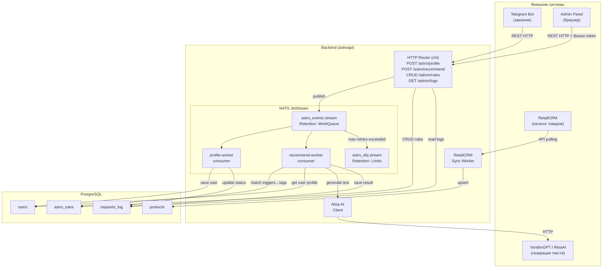
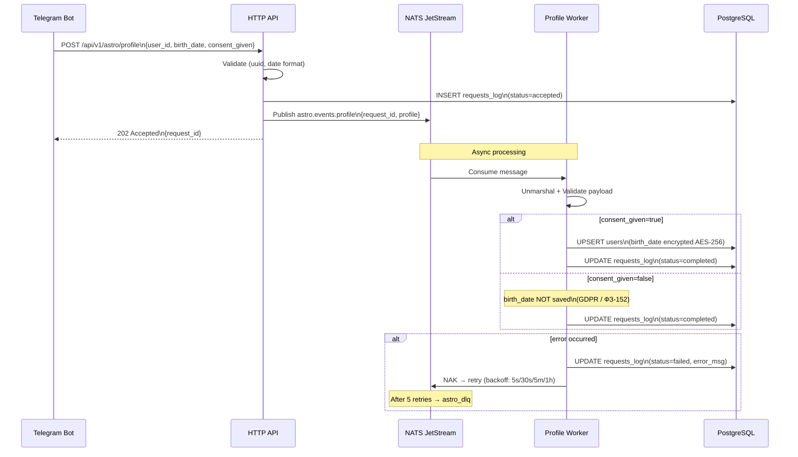
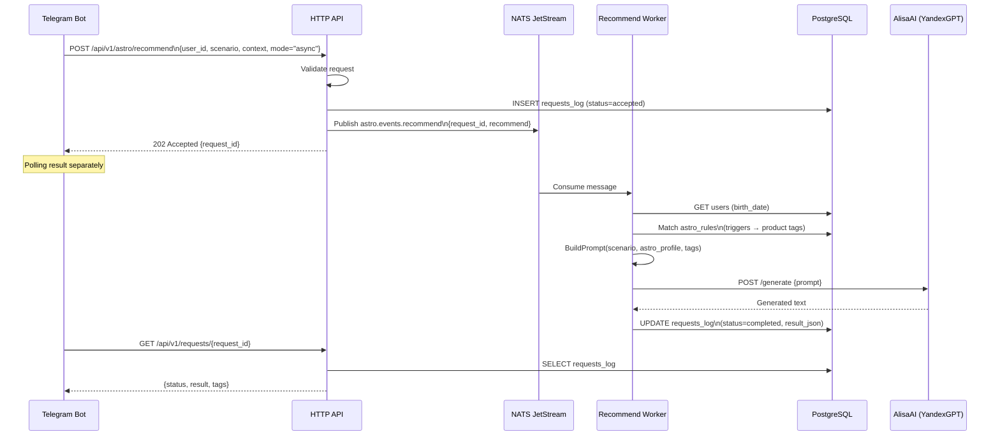
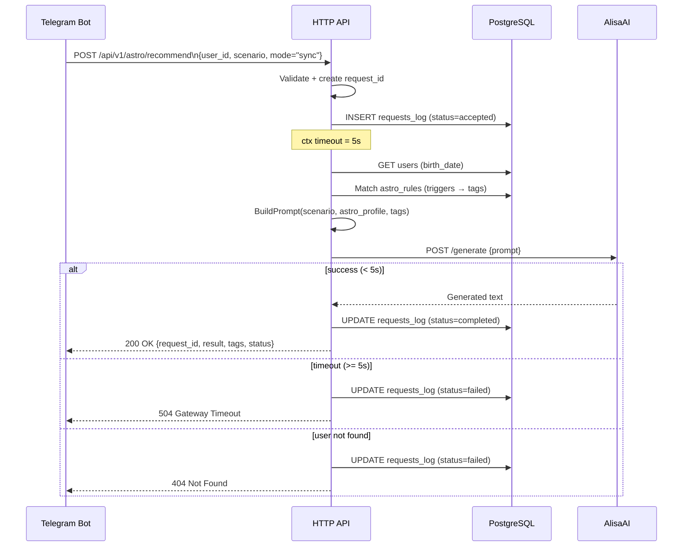
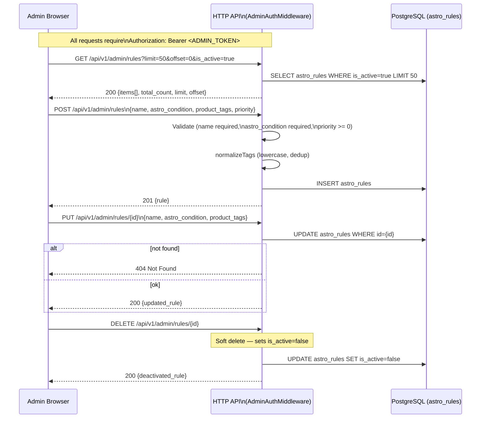
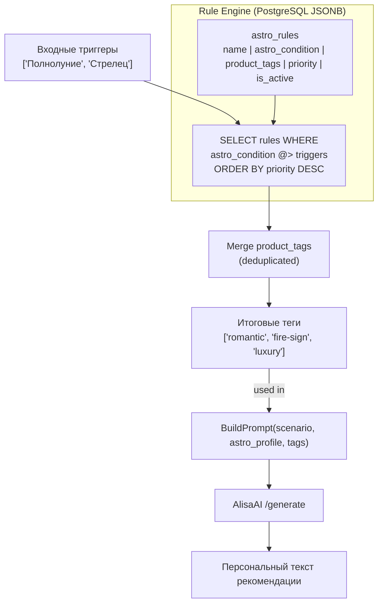
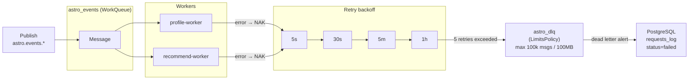
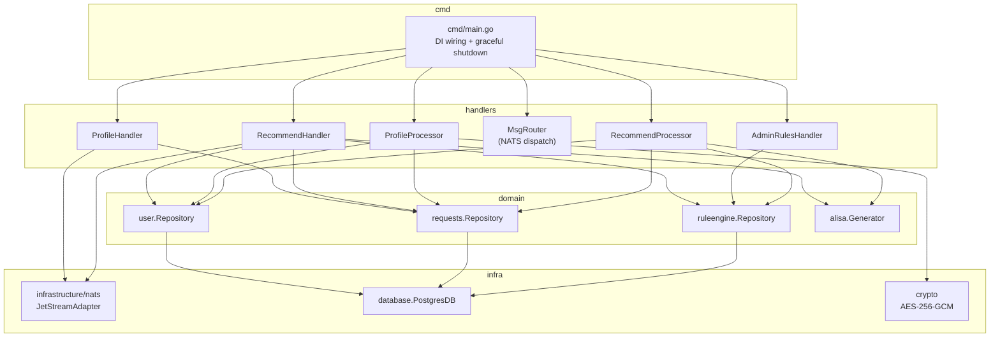

# Architecture Diagrams

## 1. Общая архитектура системы

---

## 2. Флоу бота — сохранение профиля

---

## 3. Флоу бота — получение рекомендации (async)

---

## 4. Флоу бота — получение рекомендации (sync)

---

## 5. Флоу Admin Panel — управление правилами (Rule Engine)

---

## 6. Rule Engine — маппинг триггеров на теги

---

## 7. NATS JetStream — обработка ошибок и DLQ

---

## 8. Компонентная диаграмма — зависимости пакетов

