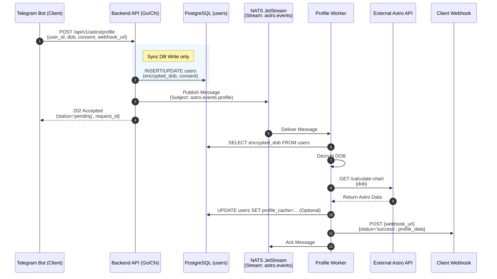
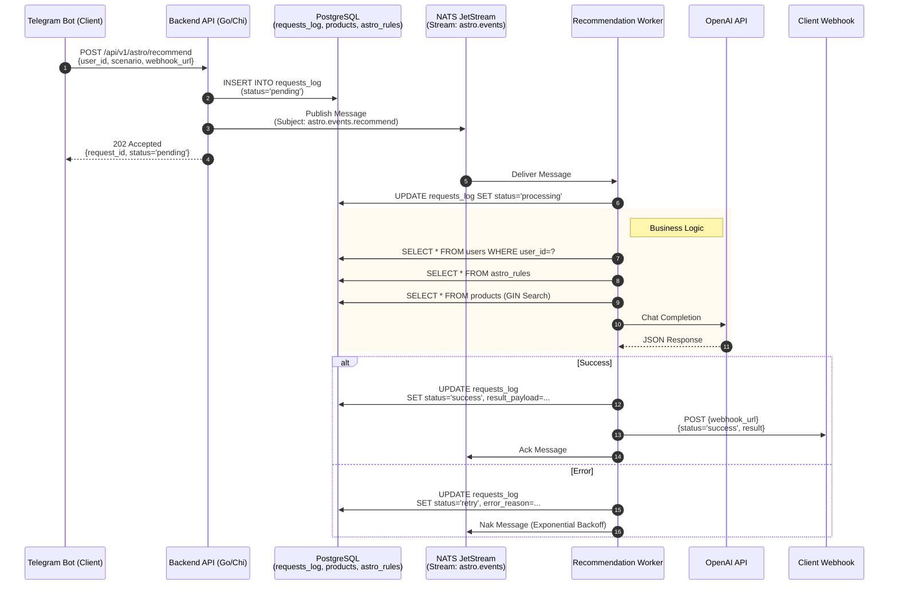

### 1. Сценарий: Запрос астропрофиля (Асинхронный)
*Эндпоинт: `POST /api/v1/astro/profile`*
*Логика:* API принимает запрос, сохраняет пользователя, публикует задачу в NATS и сразу возвращает `202 Accepted`. Воркер считает профиль и шлет результат в Webhook бота.

**Ключевые моменты:**
*   **DB:** Таблица `users`.
*   **NATS:** Используется стрим `astro.events` (или отдельный `astro.profiles`).
*   **Response:** Мгновенный `202 Accepted`.
*   **Result:** Отправляется асинхронно на `webhook_url`.

---

### 2. Сценарий: Генерация рекомендации (Асинхронный)
*Эндпоинт: `POST /api/v1/astro/recommend`*
*Логика:* Без изменений, полностью асинхронная.

**Ключевые моменты:**
*   **DB Tables:** `requests_log`, `users`, `astro_rules`, `products`.
*   **NATS:** Retry логика через `Nak` с экспоненциальной задержкой.
*   **Webhook:** Единый механизм доставки результатов для обоих сценариев.

### Сводная таблица потоков данных

| Эндпоинт | Метод | Действие API | NATS Subject | Таблицы БД (Write) | Ответ Клиенту | Доставка Результата |
| :--- | :--- | :--- | :--- | :--- | :--- | :--- |
| `/astro/profile` | POST | Save User, Publish | `astro.events.profile` | `users` | 202 Accepted | Webhook (Async) |
| `/astro/recommend` | POST | Create Log, Publish | `astro.events.recommend` | `requests_log` | 202 Accepted | Webhook (Async) |
| `/feedback` | POST | Save Feedback | None (Sync) | `requests_log` (update) | 200 OK | N/A |

**Примечание:** Эндпоинт `/feedback` остается синхронным, так как это простая запись статуса и не требует тяжелых вычислений или внешних вызовов.
